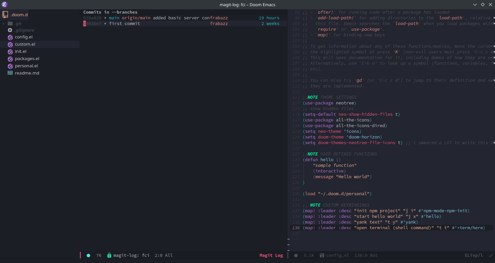

# My Emacs Setup
this repo contains my personal Doom Emacs setup (shortcut, themes, ecc)

## Setup
In order for the icons to work you have to manually run
 
 > M-x all-the-icons-install-fonts

All the other stuff should by managed by emacs

## Example

